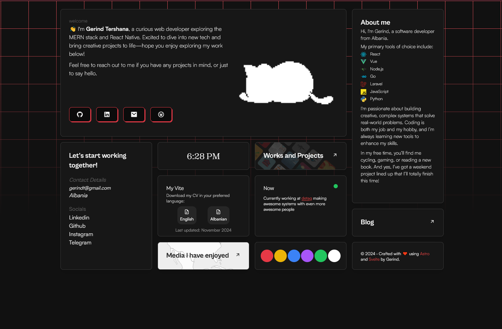
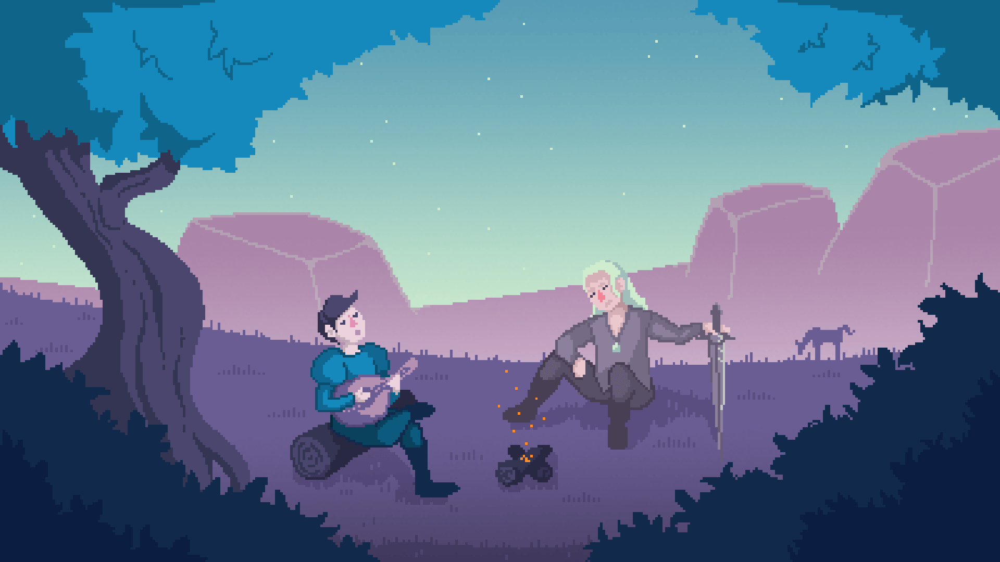

# 🚀 Bento Portofolio

A modern, minimalist portfolio and blog site built to showcase my projects and share my journey in tech.



## 👋 Who Am I

Hey! I'm Gerind Tershana, a passionate developer who loves creating on the web. I blend technical expertise with creative problem-solving to build engaging digital experiences.

## 🛠️ Tech Stack

- [Astro](https://astro.build) - Core framework
- Markdown for content
- Modern CSS & Animations
- Fully Responsive Design
- SEO Optimized

## 🚀 Quick Start

Get this site running locally in just a few steps:

### Clone the repository

git clone https://github.com/GerindT/gerind-bento.git

### Navigate to project directory

cd gerind-bento

### Install dependencies

npm install

### or

pnpm install

### Start development server

npm run dev

### or

pnpm run dev

### Site will be available at http://localhost:4321

## 📁 Directory Structure

```bash
gerind-bento/
├── src/
│   ├── components/
│   ├── content/
│   │   └── blog/
│   ├── layouts/
│   └── pages/
├── public/
├── astro.config.mjs
└── package.json

```

## 🎉 Enjoy



> PS: I was inspired by this wonderful portofolio: [here](https://github.com/Ladvace/astro-bento-portfolio)
