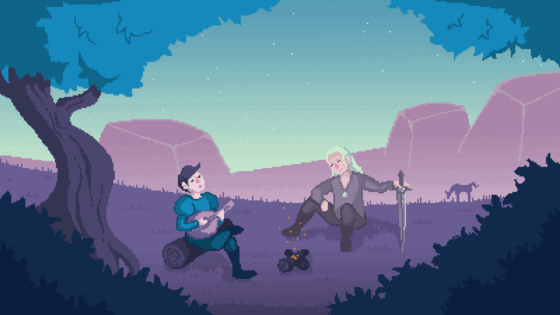

# Gerind Tershana — Portfolio

Personal portfolio and blog of Gerind Tershana, tech lead, system architect and software engineer in Tirana, Albania.

Live: https://gerindtershana.netlify.app


## What's in it

- **Home:** hero, keyboard-driven menu, selected work, profile, career timeline, a spinning globe of visited countries and a contact card.
- **Projects:** every project with its status and stack.
- **Blog:** markdown posts with an RSS feed at `/rss.xml`.
- **Media:** books, movies and manga I keep coming back to.
- **Photos:** a photography gallery. It only appears once there are photos in `src/assets/photos/`.
- **Extras:** accent colour picker, dark and light mode, optional menu sound, keyboard shortcuts (press `?`), and a hidden mascot swap on the hero.

The design is a Persona 5-inspired "calling card": ink black, one accent colour, slanted paper-white cut-outs. It is original work and does not reuse any game art or logos.

## Stack

- [Astro](https://astro.build) 4, static output, deployed on Netlify
- UnoCSS reset plus hand-written CSS in `src/style.css`
- Solid (globe) and d3 for the map
- Markdown content collections for the blog
- Self-hosted Cabinet Grotesk and Satoshi (woff2)

## Run it locally

```sh
git clone https://github.com/GerindT/gerind-bento.git
cd gerind-bento
pnpm install
pnpm dev        # http://localhost:4321
pnpm build      # static site in dist/
pnpm preview    # serve the build
```

## Where to change things

| To change | Edit |
| --- | --- |
| Projects | `src/lib/projects.ts` |
| Career, education, languages | `src/lib/career.ts` |
| Books, movies, manga | `src/lib/media.ts` |
| Countries on the globe | `src/lib/places.ts` |
| Links, name and site URL | `src/lib/constants.ts` |
| Blog posts | add a `.md` file to `src/content/blog/` (needs `title`, `description`, `pubDate: YYYY-MM-DD`) |
| Photos | drop images in `src/assets/photos/` and describe them in `src/lib/photos.ts` |
| CV PDFs | replace `public/Gerind_Tershana_EN.pdf` and `public/Gerind_Tershana_AL.pdf` |
| Share image | regenerate `public/og.png` (1200×630) after big hero changes |
| Colours and theme | CSS variables at the top of `src/style.css` |

## Project layout

```
src/
  assets/photos/     photography (optional)
  components/        header, footer, poster card, theme picker, globe
  content/blog/      markdown posts
  layouts/           BasicLayout (head, SEO, structured data) and Layout
  lib/               data and helpers
  pages/             index, projects, media, photos, blog, 404, rss.xml
public/              fonts, CVs, gifs, illustrations, icons, _headers, _redirects
```

## Deploy

Netlify builds with `pnpm build` and publishes `dist/`. Caching rules live in `public/_headers` and redirects in `public/_redirects`.

## Obligatory GIF


